# Claude Code + Qwen Setup Guide (Windows)
### Use Claude Code CLI with Qwen Paid Models — No Anthropic Account Needed!

---

## Table of Contents
1. [What is This?](#what-is-this)
2. [Requirements](#requirements)
3. [Step 1: Install Node.js](#step-1-install-nodejs)
4. [Step 2: Install Qwen CLI](#step-2-install-qwen-cli)
5. [Step 3: Install Claude Code + Router](#step-3-install-claude-code--router)
6. [Step 4: Get Your Qwen API Key](#step-4-get-your-qwen-api-key)
7. [Step 5: Create Config File](#step-5-create-config-file)
8. [Step 6: Start Claude Code](#step-6-start-claude-code)
9. [Troubleshooting](#troubleshooting)
10. [Quick Reference](#quick-reference)

---

## What is This?

This guide helps you use **Claude Code** (Anthropic's powerful AI coding assistant) using your **Qwen paid API key** — without needing an Anthropic account.

| Tool | Purpose |
|---|---|
| **Claude Code** | The AI coding assistant (interface) |
| **Claude Code Router (CCR)** | Connects Claude Code to Qwen models |
| **Qwen API** | Powers Claude Code with Qwen3 Coder Plus model |

> **No Anthropic account needed. Just your Qwen API key.**

---

## Requirements

| Requirement | Details |
|---|---|
| Operating System | Windows 10 or Windows 11 |
| Node.js | v18 or later |
| Qwen API Key | From Alibaba Cloud (paid plan) |

---

## Step 1: Install Node.js

1. Go to [nodejs.org](https://nodejs.org)
2. Click **Download Node.js (LTS)** — the LTS version is recommended
3. Run the downloaded installer (`node-vxx.x.x-x64.msi`) and follow the prompts
4. Make sure **"Add to PATH"** is checked during installation

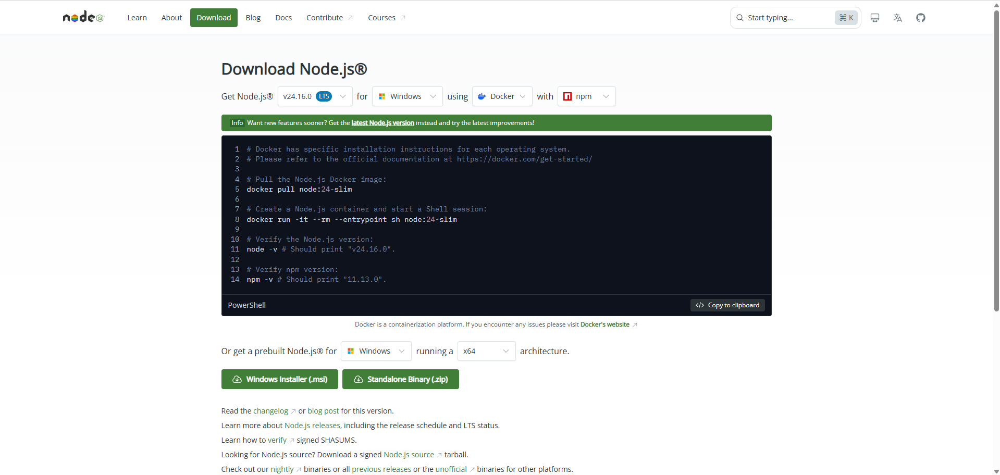

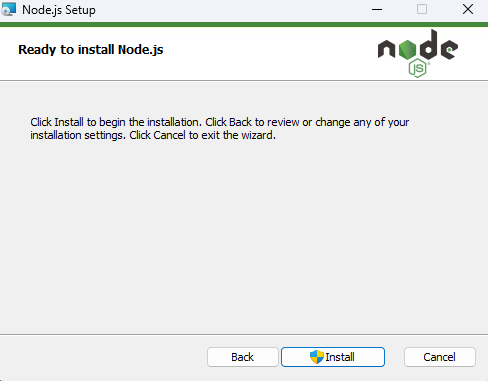

**Verify installation** — open Command Prompt and run:

```
node --version
npm --version
```


You should see `v20.x.x` for Node.js and `10.x.x` (or higher) for npm.

---

## Step 2: Install Qwen CLI

Open **Command Prompt** and run:

```
npm install -g @qwen-code/qwen-code@latest
```

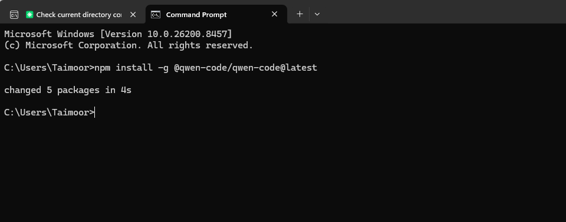

**Verify installation:**

```
qwen --version
```

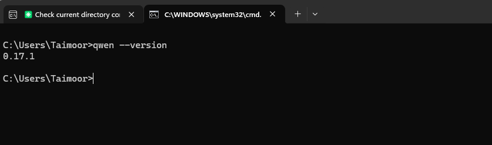

You should see a version number like `0.15.6`.

---

## Step 3: Install Claude Code + Router

Install both tools at once in **Command Prompt**:

```
npm install -g @anthropic-ai/claude-code @musistudio/claude-code-router@latest
```

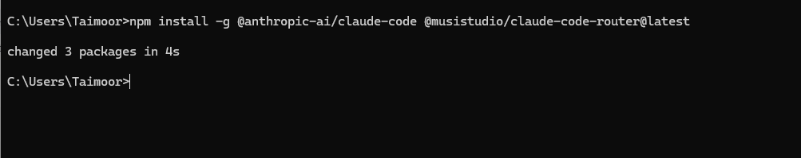

**Verify both are installed:**

```
claude --version
ccr --version
```

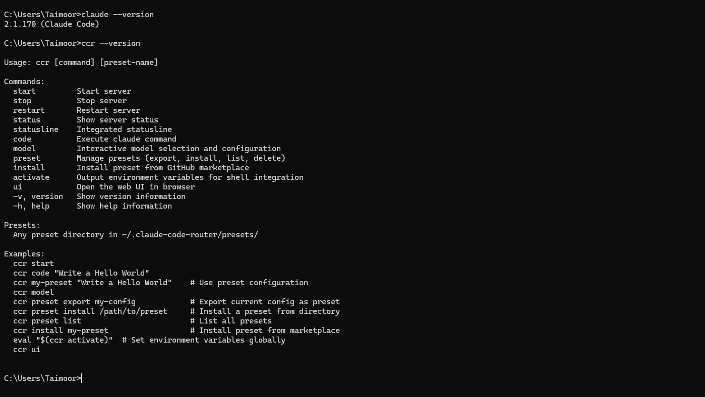

You should see a version number for Claude Code and the CCR help menu.

---

## Step 4: Get Your Qwen API Key

1. Go to [alibabacloud.com](https://www.alibabacloud.com) and log in
2. Navigate to **Model Studio** → **API Keys**
3. Click **Create API Key**
4. Copy the key — it looks like: `sk-xxxxxxxxxxxxxxxx`


> Keep your API key safe. Never share it with anyone.

---

## Step 5: Create Config File

**Create the required folder** — open Command Prompt and run:

```
mkdir %USERPROFILE%\.claude-code-router
mkdir %USERPROFILE%\.claude
```

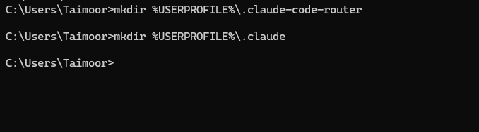

**Create the config file** — open it in Notepad:

```
notepad %USERPROFILE%\.claude-code-router\config.json
```

Notepad will ask if you want to create a new file — click **Yes**.

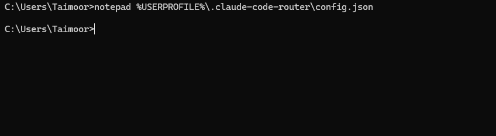

Paste the following content, **replacing `YOUR_QWEN_API_KEY_HERE` with your real API key**:

```json
{
  "LOG": true,
  "LOG_LEVEL": "info",
  "HOST": "127.0.0.1",
  "PORT": 3456,
  "Providers": [
    {
      "name": "qwen",
      "api_base_url": "https://dashscope.aliyuncs.com/compatible-mode/v1/chat/completions",
      "api_key": "YOUR_QWEN_API_KEY_HERE",
      "models": [
        "qwen3-coder-plus",
        "qwen-max",
        "qwen-plus"
      ]
    }
  ],
  "Router": {
    "default": "qwen,qwen3-coder-plus",
    "background": "qwen,qwen-plus",
    "think": "qwen,qwen-max",
    "longContext": "qwen,qwen3-coder-plus"
  }
}
```

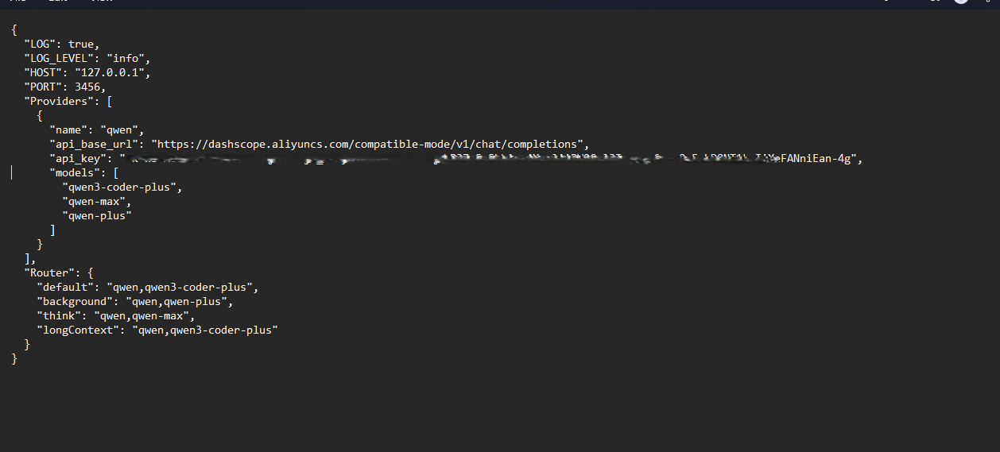

Save the file with `Ctrl+S`.

**Verify the file was saved correctly:**

```
type %USERPROFILE%\.claude-code-router\config.json
```

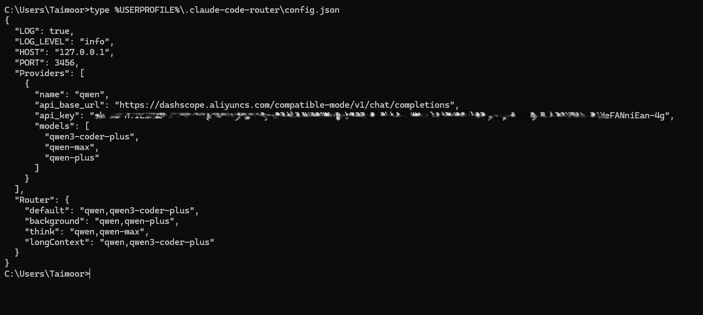

You should see your config with your API key inside.

---

## Step 6: Start Claude Code

**Start the router** in Command Prompt:

```
ccr restart
```

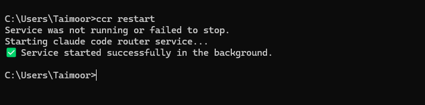

You should see:

```
✅ Service started successfully in the background.
```

**Launch Claude Code:**

```
ccr code
```

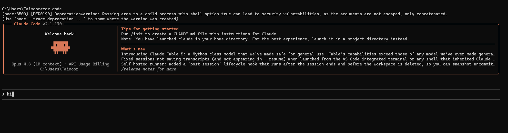

**Test it** by typing:

```
hi
```


If Qwen responds, your setup is complete!

---
