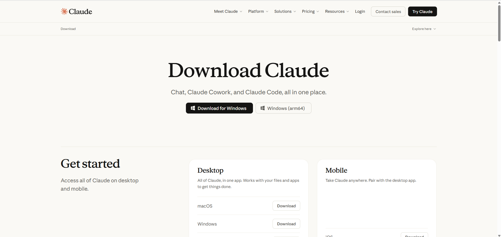
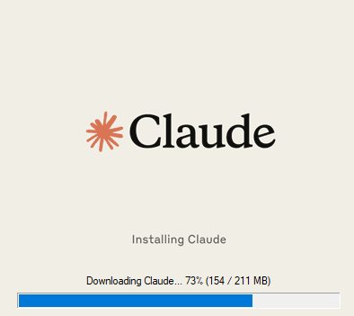
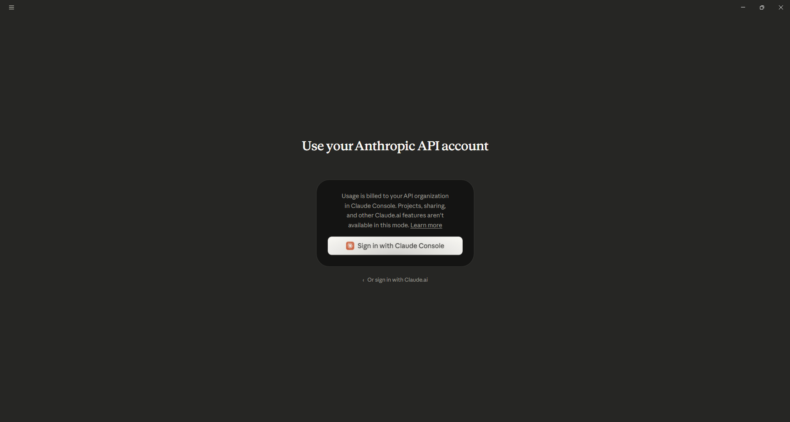

# Cowork + Claude Code Router (CCR) Setup Guide
### How to Use Cowork with Qwen or Any Third-Party Model
 
---
 
## Prerequisites
 
Before getting started, make sure you have the following:
 
- Windows 10/11
- **Node.js** installed — download from [nodejs.org](https://nodejs.org)
- **Cowork** (Anthropic's desktop app) installed
- Internet connection
---
 
## Step 1 — Check Node.js
 
Open Command Prompt and type:
 
```
node --version
```
 
If a version number appears (e.g. `v24.x.x`), you're good to go. If you get an error, install Node.js from nodejs.org first.


 
---
 
## Step 2 — Install Claude Code Router
 
```
npm install -g @musistudio/claude-code-router
```


 
After installation, verify it works:
 
```
ccr --version
```


 
---
 
## Step 3 — Get Your Qwen API Key
 
1. Go to: [modelstudio.console.alibabacloud.com](https://modelstudio.console.alibabacloud.com)
2. Create an account (select the **Singapore** region)
3. Add a payment method and enable **Worry-Free Mode**
4. In the left sidebar, click **API Key**
5. Click **Create API Key**
6. Copy your key — it will be in the format `sk-xxxx`
> **Important:** The Singapore region uses a different API endpoint:
> `https://dashscope-intl.aliyuncs.com`


 
---
 
## Step 4 — Configure CCR
 
Open the config file in a text editor:

**Windows Command Prompt:**
```
notepad %USERPROFILE%\.claude-code-router\config.json
```

**WSL / Linux terminal:**
```
nano ~/.claude-code-router/config.json
```


 
Paste the following content (replace with your actual API key):
 
```json
{
  "LOG": true,
  "LOG_LEVEL": "info",
  "HOST": "127.0.0.1",
  "PORT": 3456,
  "API_TIMEOUT_MS": 600000,
  "Providers": [
    {
      "name": "qwen",
      "api_base_url": "https://dashscope-intl.aliyuncs.com/compatible-mode/v1/chat/completions",
      "api_key": "sk-your-api-key-here",
      "models": [
        "qwen3-coder-plus",
        "qwen3-235b-a22b",
        "qwen3-max",
        "qwen3-plus"
      ]
    }
  ],
  "Router": {
    "default": "qwen,qwen3-coder-plus",
    "background": "qwen,qwen3-coder-plus",
    "think": "qwen,qwen3-coder-plus",
    "longContext": "qwen,qwen3-coder-plus",
    "longContextThreshold": 60000,
    "webSearch": "qwen,qwen3-coder-plus"
  }
}
```


 
Save the file (`Ctrl+S`).
 
---
 
## Step 5 — Start the CCR Server
 
```
ccr start
```


 
To check the server status open another CMD and type:
 
```
ccr status
```


 
You should see output like this:
 
```
✅ Status: Running
🌐 Port: 3456
📡 API Endpoint: http://127.0.0.1:3456
```
 
---
 
## Step 6 — Configure Cowork

### Install Claude Desktop

1. Go to [claude.ai/download](https://claude.ai/download)
2. Click **Download for Windows**
3. Run the installer (`Claude-Setup-x64.exe`) and follow the prompts
4. Sign in with your Anthropic account when prompted







---

### Enable Developer Mode
 
Inside Claude Desktop, navigate to:
```
Help > Troubleshooting > Enable Developer Mode
```


 
### Configure Third-Party Inference

After enabling Developer Mode, a new **Developer** menu will appear in the Claude Desktop menu bar at the top of the window.

From that menu bar, click:
```
Developer > Configure Third-Party Inference
```


A settings dialog will open. Fill in each field as follows:

| Field | Where to find it / What to enter |
|-------|----------------------------------|
| **Backend** | Click the dropdown and select **Gateway (Anthropic-compatible)** |
| **Gateway base URL** | Type exactly: `http://127.0.0.1:3456` — this is the local CCR server you started in Step 5 |
| **Gateway API key** | Paste your Qwen API key here (the `sk-xxxx` key from Step 3) |
| **Auth scheme** | Select or type `bearer` |


Once all fields are filled in:

1. Click **Apply locally** — this saves the settings to your machine only
2. Click **Relaunch Now** — Claude Desktop will restart and connect to CCR


> **Note:** After relaunch, Claude Desktop's UI looks the same but requests are now routed through your CCR server to Qwen.
 
---
 
## Step 7 — Test It
 
Type the following in Cowork:
 
```
hello
```
 
If you get a response, everything is working correctly!


 
---
 
## Daily Usage
 
Every time you restart your PC, simply run:
 
```
ccr start
```


 
That's it — Cowork will automatically connect to the router.
 
---
