# Cowork + Claude Code Router (CCR) Setup Guide
### How to Use Cowork with Qwen or Any Third-Party Model
 
---
 
## Prerequisites
 
Before getting started, make sure you have the following:
 
- Windows 10/11
- **Node.js** installed — download from [nodejs.org](https://nodejs.org)
- **Cowork** (Anthropic's desktop app) installed
- Internet connection
---
 
## Step 1 — Check Node.js
 
Open Command Prompt and type:
 
```
node --version
```
 
If a version number appears (e.g. `v24.x.x`), you're good to go. If you get an error, install Node.js from nodejs.org first.

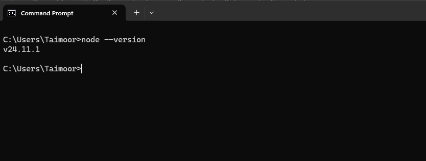
 
---
 
## Step 2 — Install Claude Code Router
 
```
npm install -g @musistudio/claude-code-router
```

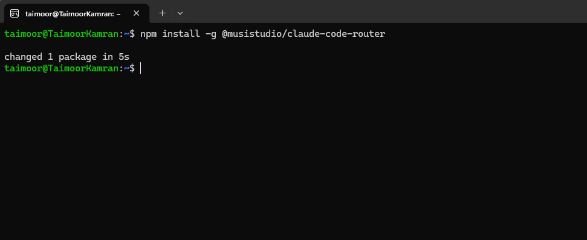
 
After installation, verify it works:
 
```
ccr --version
```

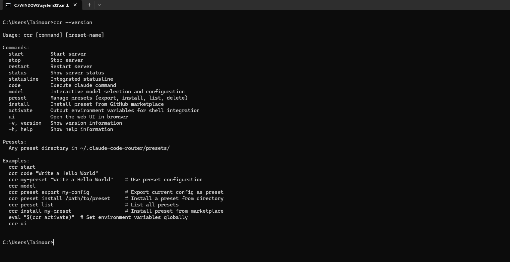
 
---
 
## Step 3 — Get Your Qwen API Key
 
1. Go to: [modelstudio.console.alibabacloud.com](https://modelstudio.console.alibabacloud.com)
2. Create an account (select the **Singapore** region)
3. Add a payment method and enable **Worry-Free Mode**
4. In the left sidebar, click **API Key**
5. Click **Create API Key**
6. Copy your key — it will be in the format `sk-xxxx`
> **Important:** The Singapore region uses a different API endpoint:
> `https://dashscope-intl.aliyuncs.com`

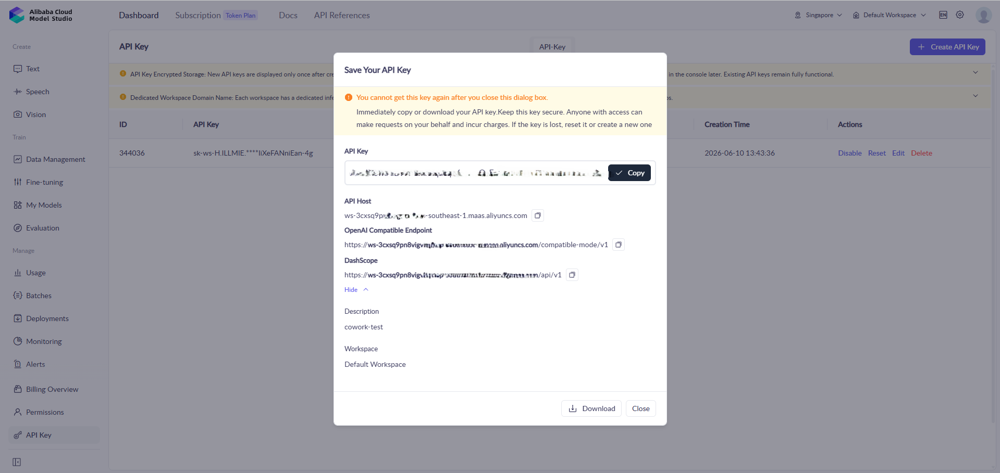
 
---
 
## Step 4 — Configure CCR
 
Open the config file in Notepad:
 
```
notepad %USERPROFILE%\.claude-code-router\config.json
```

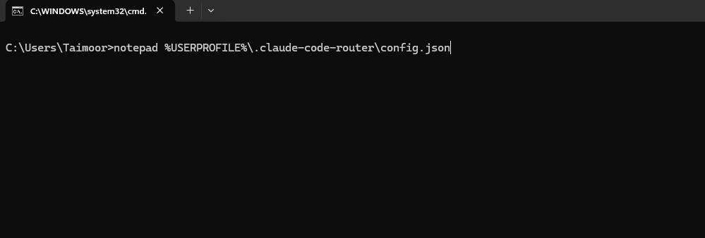
 
Paste the following content (replace with your actual API key):
 
```json
{
  "LOG": true,
  "LOG_LEVEL": "info",
  "HOST": "127.0.0.1",
  "PORT": 3456,
  "API_TIMEOUT_MS": 600000,
  "Providers": [
    {
      "name": "qwen",
      "api_base_url": "https://dashscope-intl.aliyuncs.com/compatible-mode/v1/chat/completions",
      "api_key": "sk-your-api-key-here",
      "models": [
        "qwen3-coder-plus",
        "qwen3-235b-a22b",
        "qwen3-max",
        "qwen3-plus"
      ]
    }
  ],
  "Router": {
    "default": "qwen,qwen3-coder-plus",
    "background": "qwen,qwen3-coder-plus",
    "think": "qwen,qwen3-coder-plus",
    "longContext": "qwen,qwen3-coder-plus",
    "longContextThreshold": 60000,
    "webSearch": "qwen,qwen3-coder-plus"
  }
}
```

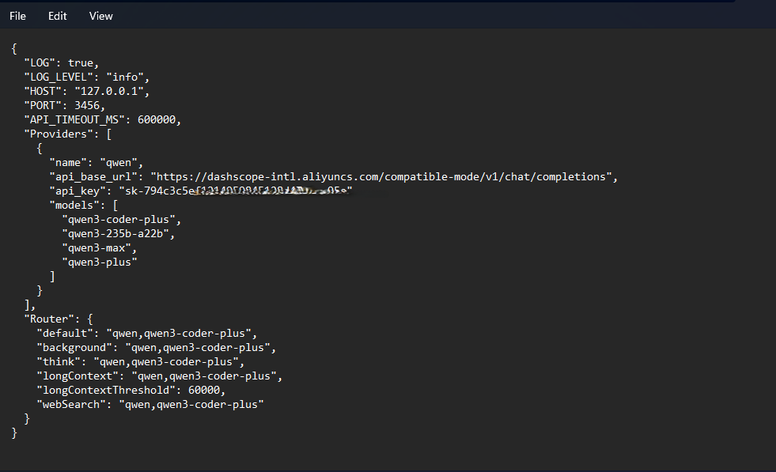
 
Save the file (`Ctrl+S`).
 
---
 
## Step 5 — Start the CCR Server
 
```
ccr start
```

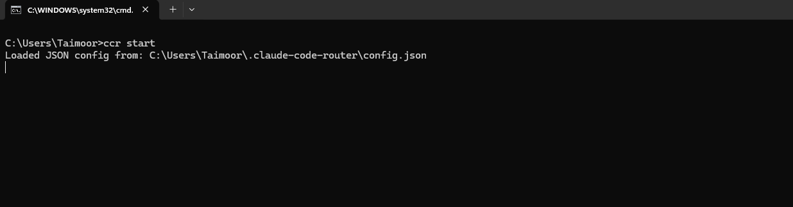
 
To check the server status:
 
```
ccr status
```

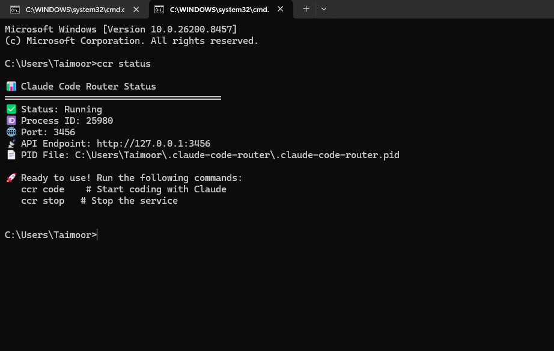
 
You should see output like this:
 
```
✅ Status: Running
🌐 Port: 3456
📡 API Endpoint: http://127.0.0.1:3456
```
 
---
 
## Step 6 — Configure Cowork
 
### Enable Developer Mode
 
Inside Cowork, navigate to:
```
Help > Troubleshooting > Enable Developer Mode
```

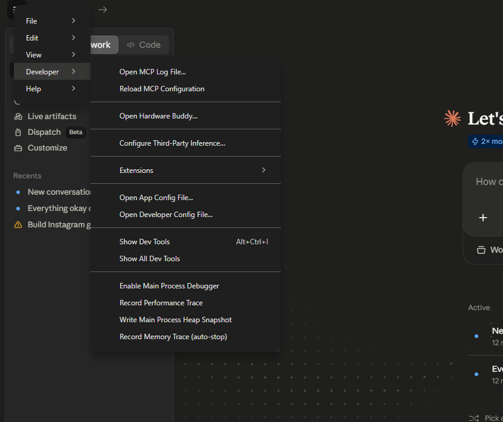
 
### Configure Third-Party Inference
 
From the menu bar:
```
Developer > Configure Third-Party Inference
```

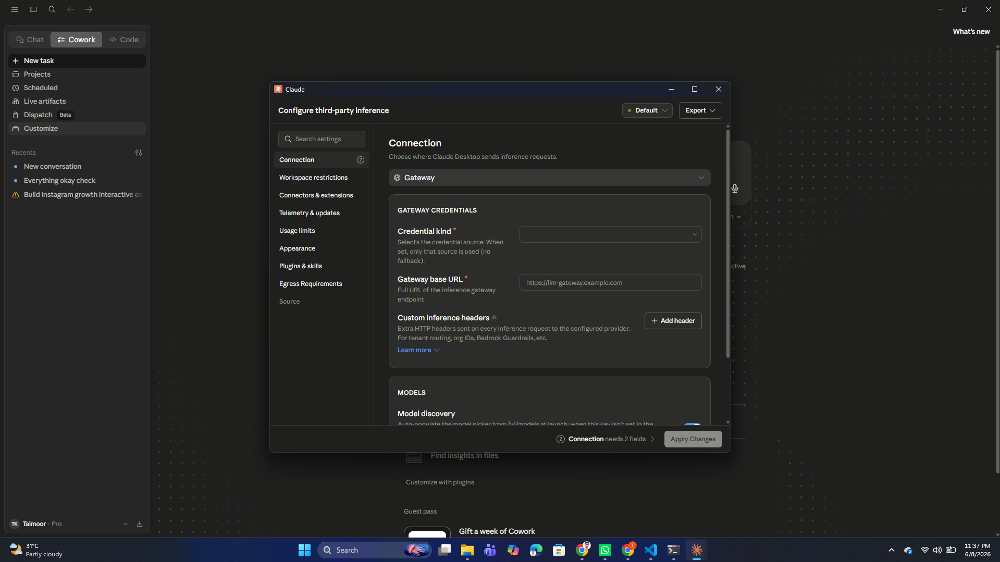
 
Enter the following settings:
 
| Field | Value |
|-------|-------|
| Backend | Gateway (Anthropic-compatible) |
| Gateway base URL | `http://127.0.0.1:3456` |
| Gateway API key | Your Qwen API key |
| Auth scheme | `bearer` |
 
Click **Apply locally**, then **Relaunch Now**.

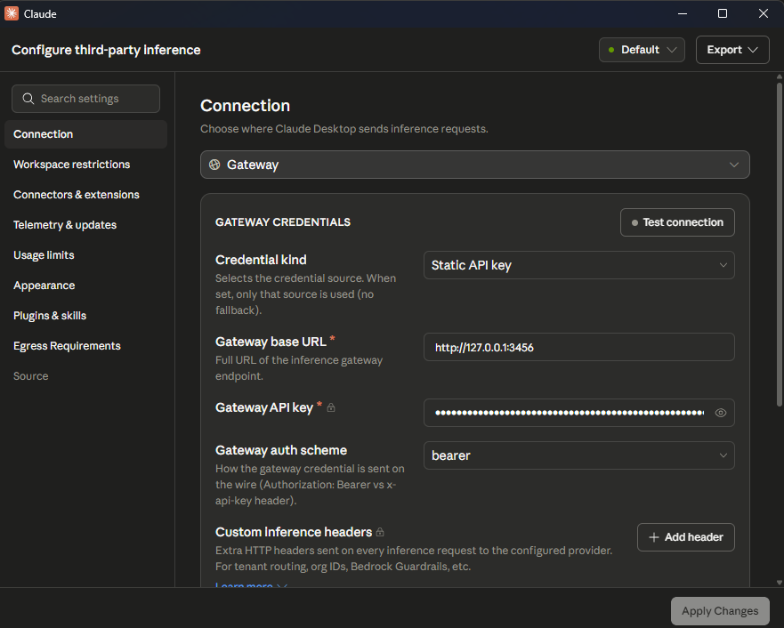
 
---
 
## Step 7 — Update the Cowork Config File
 
Open the file in Notepad:
 
```
notepad "%LOCALAPPDATA%\Claude-3p\configLibrary\<your-file-id>.json"
```
 
> To find your file ID, run:
> ```
> dir "%LOCALAPPDATA%\Claude-3p\configLibrary"
> ```

Now copy your file id and replace your <your-file-id>

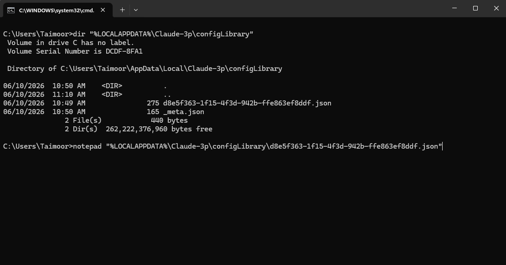
 
Replace the contents with:
 
```json
{
  "inferenceProvider": "gateway",
  "inferenceGatewayBaseUrl": "http://127.0.0.1:3456",
  "inferenceGatewayApiKey": "sk-your-api-key-here",
  "inferenceGatewayHeaders": {
    "X-Title": "Claude-Cowork"
  },
  "inferenceGatewayDefaultModel": "qwen3-coder-plus"
}
```


 
Save the file and restart Cowork.
 
---
 
## Step 8 — Test It
 
Type the following in Cowork:
 
```
hello
```
 
If you get a response, everything is working correctly!

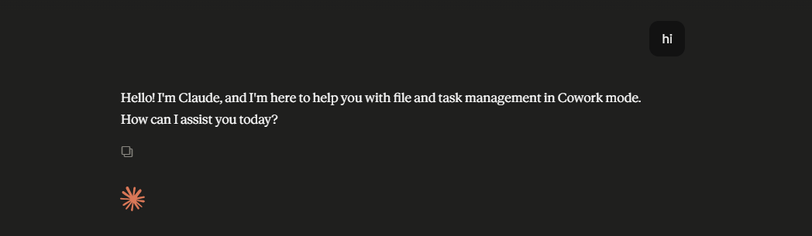
 
---
 
## Daily Usage
 
Every time you restart your PC, simply run:
 
```
ccr start
```


 
That's it — Cowork will automatically connect to the router.
 
---
 
## Troubleshooting
 
| Problem | Solution |
|---------|----------|
| `Can't reach 127.0.0.1:3456` | Run `ccr start` in Command Prompt |
| `402 credits error` | Check your API key and free quota |
| `invalid_api_key` | Make sure you're using the Singapore endpoint: `dashscope-intl` |
| Response is very slow | This is normal on the free tier — just wait a moment |
| `Provider undefined` | Check the provider name in your config.json |
 
---
 
## Important Notes
 
- Responses may be slow on the **free tier** — this is expected behavior
- The CCR server stops when your PC restarts — run `ccr start` again each time
- Cowork's UI will look like Claude, but Qwen is running in the background
- To switch back to Anthropic, simply select **Default** in Cowork settings
---
